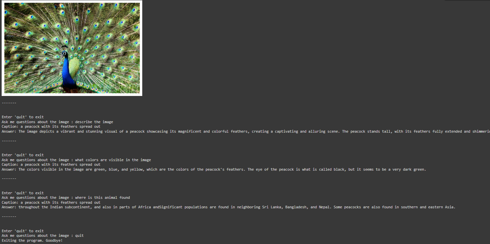
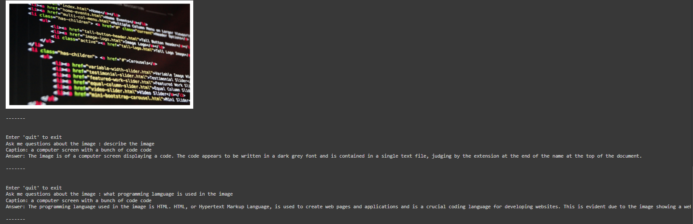

# VisioNiX--Image_recognition_conversational_chatbot
---

# VisioNiX
Introducing VisioNiX an image recognition chatbot that can give brief explaination of the image according to the prompts
VisioNiX is an image captioning and optical character recognition (OCR) tool leveraging advanced language-image models and the Tesseract OCR engine. It generates descriptive captions for images and extracts embedded text using the BLIP model and Tesseract, respectively. It processes user queries and answers them through Cohere LLM.

The **VisioNiX** project combines **Image Captioning** and **Optical Character Recognition (OCR)** to create a versatile tool for understanding both visual and textual content within images. This dual capability is useful for applications in digital content analysis, accessibility enhancements, automated metadata generation, and more.

### Project Overview

VisioNiX aims to interpret visual data by generating captions and extracting text from images. It leverages two main technologies:

1. **BLIP (Bootstrapping Language-Image Pre-training)**: A model for generating descriptive captions that capture the essence of an image. BLIP is designed to "see" and "describe" images, creating captions that relate both obvious and subtle features within a picture.
2. **Tesseract OCR**: An open-source OCR engine developed by Google that recognizes and extracts text embedded within images, allowing for textual content analysis alongside visual interpretation.





Together, these capabilities make VisioNiX a comprehensive solution for image processing.

### Key Features

- **Image Captioning with BLIP**:
  - BLIP uses a transformer-based architecture that has been pre-trained on a large corpus of image-caption pairs.
  - The model can generate captions that are contextually accurate, helping to provide an understanding of the image’s contents even without viewing it.
  - Ideal for automated metadata tagging, it aids in categorizing images based on visual descriptions.

- **OCR with Tesseract**:
  - Extracts text that appears within the image, useful for documents, signage, or any images containing written information.
  - Works alongside BLIP to add context to images that have both visual and textual information, such as labeled items, menus, or informational displays.
  - Capable of recognizing multiple languages with appropriate training data, making it adaptable for international use.

- **Language Processing**:
  - VisioNiX integrates with `language-tool-python`, a library for grammar checking and language processing. This can enhance the quality of captions by ensuring they are grammatically correct and contextually appropriate.
  - With `pandas`, it’s also easy to manage and analyze extracted text and captions in a structured format.
  - Uses Cohere API to access LLM to process queries & generate answers.

### Technical Stack

- **BLIP Model**: Uses the `transformers` and `torch` libraries for deep learning-based image captioning. This model is fine-tuned for generating coherent and accurate captions based on the image content.
- **Tesseract**: Accessible through the `pytesseract` library in Python, Tesseract processes images for text recognition and extraction. 
- **Language Processing**: By incorporating `language-tool-python`, VisioNiX ensures that captions generated by BLIP are fluent and correctly formed, improving readability and user understanding.
- **Data Handling**: `pandas` is utilized to store and manage image captions and OCR results in data tables for easy access and analysis.

### Use Cases

1. **Metadata Generation**: Automatically tag and describe images based on their content and any text they contain. This is ideal for large databases of images or media libraries.
2. **Accessibility**: Provide visually impaired users with descriptive captions of images, as well as access to any text within them, creating a more inclusive experience.
3. **Content Moderation**: For social media or public content platforms, VisioNiX can help analyze image contents and associated text for compliance with guidelines.
4. **Document Digitization**: In scenarios requiring large-scale text extraction, such as digitizing physical documents, VisioNiX aids in converting image data to searchable, editable text.

### Example Workflow

1. **Load an Image**: Start by loading an image into the notebook.
2. **Generate Caption**: Use the BLIP model to generate a descriptive caption of the image content.
3. **Extract Text with OCR**: Run Tesseract to identify and extract text within the image.
4. **Store and Analyze Results**: Store captions and OCR results in a data table for easy access or further analysis.

## Installation

1. Clone the repository:
   ```bash
   git clone https://github.com/yourusername/VisioNiX.git
   cd VisioNiX
   ```

2. Install dependencies:
   ```bash
   pip install -r requirements.txt
   ```

3. Install Tesseract OCR:
   ```bash
   sudo apt-get install -y tesseract-ocr
   ```

## Usage

Run the notebook to perform image captioning and OCR on your images:

1. Load an image into the notebook.
2. Run the provided cells to generate captions and extract text.

## Requirements

- `transformers`
- `torch`
- `tesseract-ocr`
- `pytesseract`
- `pandas`
- `cohere` (optional for advanced NLP tasks)

## Known Issues
- May not provide accurate answers to complex queries.
- May not provide accurate description for badly aligned images.

## Future Changes Intended:
- Develop my own LLM.
- Fixing known isssues.
- Deployment.
- Finetuning for better results.


